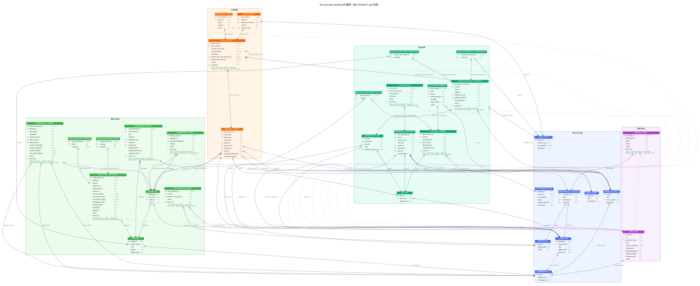

# ER 模型

价格目录回答一个问题：**某模型在某渠道、某时刻的单价是多少，出处是哪一页**。
模型按数仓的缓慢变化维度第 2 型（SCD2）组织：价格、模型元信息、上架状态、上游路由、
模型名、套餐、单位价值、计价规则都是随时间变化的维度，每次变化新增一行，不覆盖旧行，
因此任意历史时刻都能查到当时的取值。

这些表是**时态参考数据**（费率维度），不是事实表。事实是消费方的用量：
用量装载时按时点查到 `price_card_id`，存在用量事实行上，之后按该键取价。
单价不可加总（non-additive），金额 = 用量 × 单价，在消费方计算。

权威定义见 [schema/](../../schema/)（按文件名顺序加载），查询见
[price_at.sql](../../schema/queries/price_at.sql) 与
[unit_value_at.sql](../../schema/queries/unit_value_at.sql)。

## 实体关系图



图由 `python3 scripts/render_er.py` 从 `schema/*.sql` 生成（需要 Graphviz），
源文件是 [er-model.dot](er-model.dot)。改了 DDL 就重新生成，不要手改图。

读图约定：

- 颜色区分层：蓝为参与方与计量，绿为模型与供给，青为商业条款，橙为价格维度，
  紫为证据与缺口。
- 连线用鸦脚记号，线上标外键列名。`||` 为恰好一个，`o|` 为零或一个，
  鸦脚加圆圈为零或多个，鸦脚加竖线为一或多个。
- 指向 `source` 的紫色虚线表示"这一行有出处"，不参与排版。
- 列名后的 `?` 表示可为空；`GEN` 是由其他列派生的生成列。
- 各 SCD2 表的六个公共时间列合并为斜体的一行，语义见下文"时间语义"。

## 实体分层与粒度

每张表都有一个持久键（身份）；随时间变化的属性放在带 SCD2 公共列的版本表。
每张表的中文名、粒度与 Type 1 列写在 `schema/tables.toml`，测试校验每张表都有声明。

| 层 | 表 | 粒度（一行代表） | 变化方式 |
|---|---|---|---|
| 参与方与计量 | `organization` `channel` `client` `billing_unit` `meter` `region` `time_window` | 一个参与方或一个字典项 | 身份表；描述列为 Type 1 |
| | `label_namespace` | 一个渠道或客户端的标签空间 | 不变 |
| | `client_revision` | 客户端的一个版本（参照渠道） | SCD2 |
| 模型与供给 | `model` `offering` | 一个模型；渠道 × 模型 × 托管变体 | 身份表 |
| | `model_revision` + `_modality` `_effort` | 模型的一个元信息版本及其多值子项 | SCD2 |
| | `model_identifier` | 命名空间内一个名字的一个版本 | SCD2 |
| | `offering_revision` `offering_route` | 供给的一个版本；一对上下游的一个版本 | SCD2 |
| 商业条款 | `plan` `pricing_rule` `unit_rate_series` | 一个套餐；一条规则；一种单位价值口径 | 身份表 |
| | `plan_revision` + `_client` `plan_allowance` | 套餐的一个版本及其子项 | SCD2 |
| | `pricing_rule_revision` + `_scope_model` `_scope_meter` | 规则的一个版本及其适用范围 | SCD2 |
| | `unit_rate` | 单位价值口径的一个版本 | SCD2 |
| 价格维度 | `price_series` | 一组固定适用条件（价目卡的持久键） | 身份表 |
| | `price_card` + `price_rate` | 系列的一个版本；卡 × 计价项 × 阶梯下界 | SCD2 |
| | `price_evidence` | 卡 × 来源 | 只增 |
| 证据与缺口 | `source` | 一次抓取 | 只增，写入后不可改 |
| | `price_gap` | 命名空间内一个标签的一个缺口版本 | SCD2 |

**Type 1 列**只有名称、说明、主页、价格页 URL 这类描述性属性，改写不影响任何历史查价；
其余列要么属于身份（不可改），要么放进版本表（SCD2）。哪些列是 Type 1 写在
`schema/tables.toml` 的 `type1`，只增不改触发器由它生成。

多值属性（模态、强度档、套餐包含的客户端、规则适用范围）都拆成子表，满足第一范式并可加
外键。`time_window` 的星期与时段范围是不可再分的值对象，保留 JSON；时段定义变化时新建
一个 `window_id`。

## 渠道与商业角色

同一个模型可以从很多地方买到。渠道按与厂商的业态关系分为七类：

| `channel.kind` | 含义 | 例子 |
|---|---|---|
| `first_party_api` | 厂商自营 API | Claude API、OpenAI API、Gemini API |
| `first_party_subscription` | 厂商自营订阅 | Claude Max、ChatGPT Pro、Google AI Pro |
| `cloud_partner` | 有合作或投资关系的云平台 | Bedrock、Vertex AI、Microsoft Foundry |
| `enterprise_platform` | 数据或业务平台内置 | Snowflake Cortex、Databricks、Agentforce |
| `aggregator` | 聚合商与网关 | OpenRouter、Vercel AI Gateway |
| `relay` | 中转站，按倍率转售上游额度 | one-api / new-api 搭建的站点 |
| `tool_bundle` | 工具内置 | Kiro、Poe、Cursor、GitHub Copilot |

价格挂在"渠道 × 模型 × 托管变体"的**供给**（`offering`）上。每个供给版本
（`offering_revision`）记录四件事：

- **商业角色**：运营方（谁跑推理）、卖方（seller of record）、开票方。三者可以各不相同，
  例如 Foundry 上的 Claude 由 Anthropic 运营、Anthropic 作卖方、微软开票。
- **可信度** `vendor_relationship`：`first_party`、`contracted_partner`、
  `disclosed_reseller`、`self_declared_official`、`account_pool`、`unknown`，
  以及是否披露上游。中转站被审计出替换模型的情况，就由这一列区分。
- **渠道侧标识**：渠道模型 ID、API 面（如 `bedrock-runtime` 与 `bedrock-mantle`）。
- **渠道级上限**：渠道自设的上下文窗口与最大输出，NULL 表示沿用厂商元信息。
  工具把上下文窗口限得比厂商更小时，记在这里。

**上游路由**（`offering_route`）记录供给由哪个上游供给实际提供：Kiro 与 Snowflake 的
Claude 走 Bedrock（`sole`），OpenRouter 在多个上游之间分流（`load_balanced`）。
经不同上游价格不同时，价格系列用 `upstream_offering_id` 区分，且该系列生效时必须有
对应的路由（`v_card_upstream_without_route`）。单次请求实际命中哪个上游，
是用量侧的观测事实，不在目录里推断。

**模型与名字分开。** `model_id` 取厂商规范 API ID，是模型的持久键，带日期的固定快照各算
一个模型。渠道自己的路由伪模型（如 Auto）是 `model.kind = 'router'` 的模型，只能在其所有者
的渠道上供给。名字与价格缺口挂在**标签命名空间**（`label_namespace`）上，它是渠道与客户端
的超类型，取代"渠道或客户端二选一"的排他弧。

## 模型标识

同一个模型在各处叫法不同，而且会变：渠道 API 用自己的写法（`anthropic.claude-opus-5-5`、
`openai/gpt-5`、`claude-haiku-4-5@20251001`），订阅与工具的界面只显示名称（`Claude Opus 5`），
客户端与用量日志又有自己的标签（`agy-model:1298`、`claude-opus-5[1m]`）。这些名字都存在
`model_identifier`，这是名字唯一的存放处：一行是某命名空间里的一个名字在一段时间内
指向哪个模型（渠道命名空间里还指向具体供给）。

| `kind` | 含义 | 例 |
|---|---|---|
| `api_id` | 渠道 API 里可调用的模型 ID，含浮动名 | `anthropic.claude-opus-5-5`、`gpt-5` |
| `display_name` | 渠道界面或文档里的显示名 | Copilot 的 `Claude Opus 5` |
| `label` | 客户端或用量日志里的标签 | `agy-model:1298` |

- **改名**：旧名字的行结束（`valid_to`），新名字的行开始；浮动名换指向同理。任意时刻
  用当时的名字都能解析，改名前后的用量都能对上同一个模型。
- **解析唯一**：同一命名空间里，同一个名字在同一时刻只能指向一个模型或供给
  （`v_identifier_ambiguous`）；指向的供给必须属于该命名空间的渠道
  （`v_identifier_offering_mismatch`）。
- **精确解析，宽松搜索**：查价按名字原文精确解析；`identifier_key` 是宽松匹配键（小写，
  空格、下划线与点号统一为连字符），只用于搜索候选，不参与查价。
- 录入时，供给条目里的 `channel_model_id` / `channel_model_name` 展开为该供给的 `api_id` /
  `display_name`；其余名字用 `[[model_identifier]]` 条目录入。

## 计价：单位、价目卡与规则

**计费单位**（`billing_unit`）把"用什么记账"做成实体：法币、平台货币（CCU、
AI Credit、DBU）、工具积分与点数、请求次数、中转站额度。**单位价值**（`unit_rate`）
说明 1 个单位值多少个另一单位，并按口径区分：

| `rate_kind` | 含义 | 例子 |
|---|---|---|
| `list` | 公开标价 | CCU = 0.01 USD |
| `included` | 套餐内折算，由套餐价推导 | Kiro Pro 20 USD / 1,000 credits = 0.02 |
| `overage` | 超额单价 | Kiro 0.04 USD / credit；Copilot 旧制 0.04 USD / request |
| `top_up` | 充值价，含手续费与满额折扣 | OpenRouter 1.055 USD 买 1 USD 额度 |

同一单位的价值随渠道、套餐、口径与时间而变，所以价值挂在 `unit_rate` 上，
不挂在单位上。口径（单位、目标单位、`rate_kind`、地域、渠道、套餐、充值门槛）是
`unit_rate_series` 的持久键，数值随时间变化记在 `unit_rate`。换算可以多跳：中转站额度 → 站内"美元" → 人民币。
`unit_value_at.sql` 列出全部路径，由调用方按场景选口径。没有路径表示价值未公开
（如 Databricks DBU），这本身是需要保留的事实。

**价格系列**（`price_series`）是价格的持久键，由以下适用条件确定：

```
供给 + 服务档 + 地域 + 计价单位 + 计价时段 + 套餐 + 上游 + 承诺期
```

系列 ID 由这些条件拼成（如 `openrouter/claude-sonnet-4-6/standard/us/USD/via:…`），
CHECK 保证 ID 与各列一致；`供给` 与 `套餐` 通过带 `channel_id` 的复合外键保证属于同一渠道。
**价目卡**（`price_card`）是系列的版本，用整数代理键。卡下每个计价项一行费率（`price_rate`），金额以卡的计价单位计。计价项覆盖三种价格形态：

- 按量：`input`、`output`、缓存读写等，单位是每百万 token。
- 按次：`request`、`message`，如 Copilot 旧制 Opus 4.7 = 27 次 premium request。
- 相对倍率：`relative_usage`，如 Kiro 以 Auto 为 1x，Sonnet 5 = 1.3x。
  基准用量不公开，只能在同一渠道内横比。

长上下文阶梯是同一计价项的另一行，`context_min_tokens` 为阈值。
容量计价（PTU、GSU、Reserved）用 `provisioned` / `reserved` 服务档加承诺期表达。

**套餐专属价优先。** `plan_id` 为 NULL 的系列对所有套餐通用；指定套餐的系列优先。
Copilot 年付旧制按 premium request 计、新制按 token 计，两张卡并存，查询时按用户所在
套餐取卡。

**计价规则**（`pricing_rule` 为身份，`pricing_rule_revision` 为版本）记录"参照价 × 系数 + 附加额"式的表述：

| `kind` | 例子 |
|---|---|
| `markup` | 数据驻留端点为标价 ×1.1；中转站按用户分组设倍率 |
| `discount` | 选用某路由伪模型或套餐时按比例减价 |
| `additive` | Cursor 经 Auto 调用第三方模型，每百万 token 加 0.25 USD |
| `usage_fee` | 按用量收取固定比例的平台费 |
| `byok_fee` | OpenRouter 自带密钥时收上游费用的 5%，每月前 25,000 USD 免收 |

充值手续费体现为 `unit_rate` 的 `top_up` 价，不另设规则。
**页面公布的数字优先于规则。** 规则推导出的价目卡物化存储，`derivation =
computed_from_rule`，并用 `derived_from_rule_revision_id` 与 `derived_from_card_id` 指回规则版本和
参照价目卡。渠道公布的数字与按规则推算的结果不一致时，只有存公布数字才保留得住这类差异。

**套餐**（`plan`）推广到所有渠道：订阅档、工具会员档、中转站用户分组、
老用户保留原价的旧制都是套餐。套餐版本的额度（`plan_allowance`）按池、单位与刷新窗口
（5 小时、日、周、月）记录；数量未公开时为 NULL，并以 `price_gap` 登记缺口。

## 时间语义

每张 SCD2 表带同一组列，语义一致：

| 列 | 含义 |
|---|---|
| `valid_from` / `valid_to` | 业务时间：这一版在现实中何时生效，左闭右开，`valid_to` 为 NULL 表示至今 |
| `date_basis` | 生效时间的依据：`official_effective` 官方生效日、`official_announced` 官方预告的未来日、`first_observed` 本地首次观察、`inferred` 推断 |
| `recorded_at` | 记录时间：这一行写入目录的时刻 |
| `superseded_at` / `supersede_reason` | 这一行被更正（`correction`）、撤销（`cancelled`）或重述（`restated`）的时刻与原因；NULL 表示当前认可 |
| `source_id` | 佐证这一行的主来源 |

时间一律为 UTC 的 `YYYY-MM-DDTHH:MM:SSZ`，由 CHECK 校验格式，因此字符串比较即时间比较；
`superseded_at` 必须晚于 `recorded_at`。

标准 SCD2 只有业务时间。额外保留记录时间，是因为价格会**预告后撤销**：
Claude Sonnet 5 原定 2026-09-01 涨到 $3 / $15，后宣布取消。做法是把预告行标为
`cancelled`、把原先截止于 9-01 的引入价标为 `restated`，再写一行不设截止的新版本。
按当前认可查询得到 $2 / $10；把 `known_at` 设为撤销前的日期，则回放出当时以为的
$3 / $15。

**只增不改。** 版本行写入后只允许补写一次 `superseded_at` 与 `supersede_reason`；
身份表只允许改写 Type 1 列；任何表都不允许删除。`schema/08_append_only.sql` 的触发器
强制这一点，由 `scripts/gen_append_only.py` 从 DDL 生成，测试校验二者同步。
更正的做法是先把旧行标为 superseded，再写入 `recorded_at` 不早于该时刻的新行。

价目卡的来源摘录都记在 `price_evidence`：主来源的摘录标 `primary`（至多一条，来源必须是
卡的 `source_id`），其他佐证标 `supports`，矛盾的来源标 `contradicts`：
同一价格的两个官方来源说法不一时，两种说法并存可查。

## 不变量

能声明的规则用约束表达，跨行、跨表或带时间条件的规则用视图表达，视图必须为空。

| 不变量 | 落点 |
|---|---|
| 同一持久键下，业务区间与记录区间同时重叠的两行视为冲突 | 视图 `v_scd2_overlap`（覆盖全部 SCD2 表，含 `price_gap`） |
| 有阶梯费率的价目卡必须声明阶梯边界，反之亦然 | 视图 `v_context_tier_mismatch` |
| 每张价目卡都有基础档费率 | 视图 `v_card_without_base_rate` |
| 上游必须属于另一个渠道 | 视图 `v_route_within_channel` |
| 指定上游的价格系列在生效时有对应路由 | 视图 `v_card_upstream_without_route` |
| 规则推导的价目卡，规则属于同一渠道 | 视图 `v_derived_card_rule_mismatch` |
| 相对倍率不能以法币计价 | 视图 `v_relative_rate_in_fiat` |
| `primary` 佐证与卡的主来源一致 | 视图 `v_primary_evidence_mismatch` + 唯一索引 |
| 路由伪模型只在所有者渠道上供给 | 视图 `v_router_outside_owner` |
| 同一命名空间里同一名字同一时刻只指向一个模型或供给 | 视图 `v_identifier_ambiguous` |
| 模型名指向的供给属于该命名空间的渠道 | 视图 `v_identifier_offering_mismatch` |
| 供给、价格系列、单位价值系列的 ID 与各组成列一致 | 表级 CHECK |
| 供给与套餐属于价格系列、规则、单位价值系列所在渠道 | 复合外键 `(…, channel_id)` |
| 地域、来源发布方取自字典 | 外键 `region`、`organization` |
| 时间为 UTC ISO 格式，更正晚于录入 | 各时间列的 CHECK |
| 金额是只含数字与一个小数点的十进制原文 | 各金额列的 CHECK |
| 规则推导的价目卡必须指回规则版本 | `price_card` 的 CHECK |
| 单位不能以自身计价 | `unit_rate_series` 的 CHECK |
| 历史行不可改写或删除 | `08_append_only.sql` 触发器 |
| 查不到价格时返回空，不回退到相邻模型 | `price_at.sql` 契约与 `price_gap` |

同一持久键下若要两张价目卡同时有效，说明适用条件还没拆清楚，应先补维度，
而不是放宽不变量。

## 查询

`price_at.sql`：按渠道（或客户端在该时刻的参照渠道）、模型名、业务时刻查价。
依次确定渠道 → 按 `model_identifier` 精确解析模型名（客户端命名空间优先）→ 选价目卡
（套餐专属系列优先）→ 选长上下文阶梯。
返回多张卡说明参数不足以唯一确定价格，调用方应补全参数。计价时段（如 DeepSeek 高峰）
需要时区、星期与节假日历判定，由调用方完成后传入 `window_id`。

`unit_value_at.sql`：把一个计费单位换算成另一个，列出全部路径与每跳口径。

`10_query_views.sql`：`price_history` / `price_current` 是价格宽表，
`model_identifier_lookup` / `model_identifier_current` 是模型名对照。
`scripts/query_price.py` 封装 `price_at.sql`，`--search` 按宽松匹配键搜索模型名。

**消费契约。** 消费方在装载用量时调用 `price_at.sql`，把返回的 `price_card_id`
（与需要时的 `unit_rate_id`）存进用量事实行，这就是装载时的代理键查找。之后重算成本
按该键取价，不再按时间重新解析；目录里后来的更正不会悄悄改变已结算的成本，
需要重算时显式传 `known_at`。

## 数仓视角

目录是价格与模型的**一致性维度**（conformed dimensions），供各消费方的用量事实共用。

| 数仓角色 | 本模型 | 说明 |
|---|---|---|
| 一致性维度 | `model`、`channel`、`offering`、`meter`、`region`、`billing_unit` | 持久键是自然键，跨消费方一致 |
| 缓变维度 | 各 `*_revision`、`price_card`、`unit_rate`、`model_identifier` | SCD2，另带记录时间，可回放当时的认知 |
| 键映射（key map） | `model_identifier`，视图 `model_identifier_lookup` | 外部名字 + 命名空间 + 时刻 → `model_id` / `offering_id` |
| 费率（参考事实） | `price_rate`，粒度为卡 × 计价项 × 阶梯下界 | 单价不可加总 |
| 宽表 | 视图 `price_history`、`price_current` | 价格与维度属性展开，供直接查询与导出 |

用量装载的标准路径：用量行带着模型名、渠道或客户端、发生时刻；先按
`model_identifier_lookup` 做时点查找（as-of lookup）得到 `model_id`，再调用 `price_at.sql`
取 `price_card_id` 存入事实行。名字在目录里查不到时，登记 `price_gap`，不猜相近的模型。
`model_identifier_lookup` 另含目录自身的名字（规范模型 ID 与展示名，`namespace_kind =
'catalog'`），便于把只写了厂商展示名的数据对上模型。

## 暂不建模

以下内容当前不建模，等有需求时再加：

- 合同价层：私有报价、按年合同额阶梯折扣、承诺抵扣（MACC、AWS commitment）。
- 容量计价的细节：最小购买量、token 到配额的消耗比例（如输出 ×5）。
- 按套餐开放的模型可用性（高档套餐才开放的模型）。
- 路由伪模型的目标集合，以及免费额度与最低计费。
- 跨模型比较所需的 tokenizer 换算系数。
